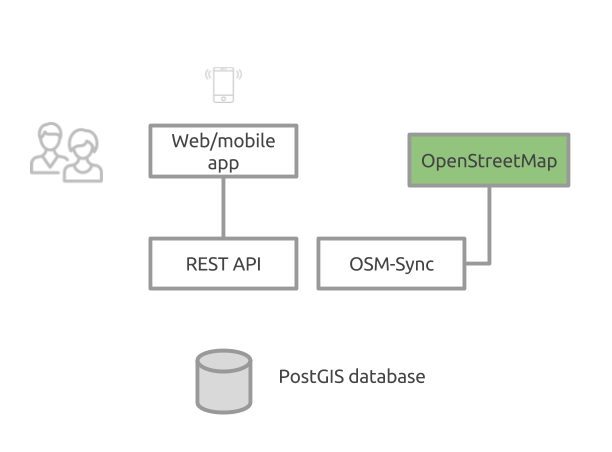

## Overview
Welcome to OpenClimbMap (OCM) project, the future search engine for rock climbers!

This project was born out of frustration over the lack of free online climing maps.  For example, how do I locate climbs near me and/or share GPS coordinates with friends and the climbing community?

All data will be available under an open license and kept in sync with OpenStreetMap. See also [REST API](https://openbeta.github.io/beta/) project. 

What can the app do at the moment?
- Show climbing routes as markers within a search radius. Data was previously bulk imported from OpenStreetMap with tag `sport=climbing`.

Work-In-Progress:
- Show detail information such as name, grade, link to external sites on mouse click
- Allow editing and adding new routes

Live demo:
- https://openbeta.io/demo

## Want to Help out?
Please see the [Contributing guide](CONTRIBUTING.md).

## License
GPL v3

## The big picture

Roadmap
- Mobile app with offline maps

**Climb on!**
